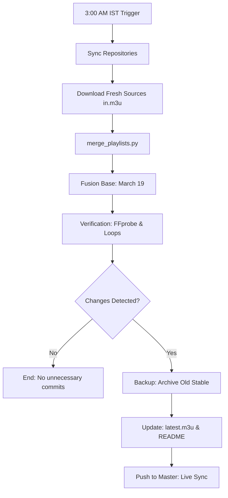

# 🔄 IPTV Automation Life-Cycle

This document visualizes the 24-hour cycle of your IPTV playlist management system.

## 📅 Daily 3:00 AM IST Flow

---

## 🛠️ Logic Breakdown

### 1. Permanent Baseline Fusion
*   **The Key:** The **March 19 Stable Version** (Commit `41c1df6`) is now the permanent base for every daily update.
*   **The Strategy:** We only add *new* streams found in external sources to this stable foundation. This ensures your preferred 2-stream Sony SAB setup never changes.

### 2. High-Performance Filtering
*   **Latency Gate:** If a stream takes more than 5 seconds to load on the GitHub runner, it's purged. This ensures your channel switching feels "Instant".
*   **Media Sequence Monitoring:** We monitor the internal HLS manifest. If a stream repeats the same segments twice in 15 seconds, it is marked as **LOOPING** and removed to prevent frustration.

### 3. Smart Differential Update
*   **The Check:** The system compares the new result with the current `latest.m3u`.
*   **The Trigger:** If and only if changes are found, the system archives the old version and pushes the update. This keeps your commit history clean and meaningful.
