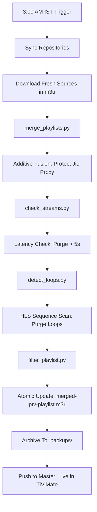

# 🔄 IPTV Automation Life-Cycle

This document visualizes the 24-hour cycle of your IPTV playlist management system.

## 📅 Daily 3:00 AM IST Flow

---

## 🛠️ Logic Breakdown

### 1. Multi-Source Fusion
*   **The Key:** Every channel is unique by its **Stream URL**.
*   **The Strategy:** We never overwrite a working URL. If a source provides a NEW quality variant (e.g. Sony SAB 1080p), it is added alongside existing entries.

### 2. High-Performance Filtering
*   **Latency Gate:** If a stream takes more than 5 seconds to load on the GitHub runner, it's purged. This ensures your channel switching feels "Instant".
*   **Media Sequence Monitoring:** We monitor the internal HLS manifest. If a stream repeats the same segments twice in 15 seconds, it is marked as **LOOPING** and removed to prevent frustration.

### 3. Safety Snapshot
*   **The Backup:** Every single run creates a dated snapshot. 
*   **Historical Access:** You can always access your historical playlist state at:  
`https://shahakshay938.github.io/backups/playlist-YYYY-MM-DD.m3u`
